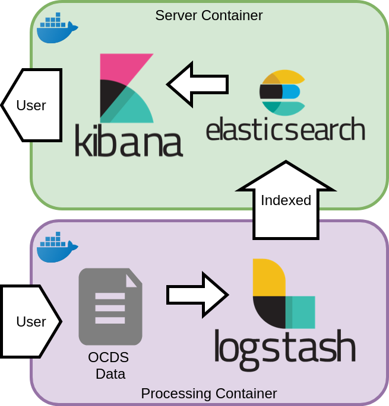

# ELK Platform to Analize OCDS format Data Procurement

As stated in this manual's introduction, analyzing data of Public Procurement in Mexico is a key task for government correct democratic scrutiny.

To achieve this, we must have the right technological tools to make OCDS standard publicly available in a user-friendly way that enables everyone to provide more reliable information and create this data visualization.

ELK platform (ElasticSearch, Logstash, Kibana) provides with all the necessary tools to achieve this goal.

This manual allows you to create a system with the following characteristics:

- User-friendly graphical interface but with database access capabilities.
- An indexed search engine that allows data update and correction at all times.
- A data ingestion engine, which allows fast data entry to the database and data processing as the Mexican government publishes it.

## Architecture

Each of these features will be backed up by Kibana, ElasticSearch and Logstash. This is how the used architecture is defined:

- ElasticSearch Cluster in order to index and contain data.
    - Initially, the cluster will only allocate one node, but nodes could increase in the future.
    - A specialized index with all data release.
- Kibana Interface visualizes data in the table of contents.
    - Kibana and ElasticSearch will be into the same Docker container to make an easier delivery.
-  A Logstash pipeline ready to process OCDS data and index it in ElasticSearch.
    - In order to run more easily, this pipeline will be into a Docker container.




We will name **Server Container** to the server hosting ElasticSearch and Kibana, as this container will be running as long as this service is offered.


And **Processor Container** to the one that only runs Logstash to process data.

### Extra: Docker Containers

We will use a Docker container to package our solution, its architecture and tools.

This manual does not teach details about Docker and its technology, but we can easily define it as
Software "boxes" or "containers" (as in for trailers or cargo ships), where we store everything we need to implement our project.

This should make any Software tool distribution easier, as the only previous is to install Docker. This step should be similar to installing any other software in the chosen OS.

Once you have Docker installed, our software is ready to start automatically, without any other software.

Another advantage by using Docker is that it keeps stability between what is developed and what is distributed. You can avoid problems such as "it works correctly in my computer".

> In the following sections, different docker commands will be used. Among the most important details, we have
> the "Volumes" concept, which consists of "shared folders" between the container and our computer.
    ```
    docker run -v LOCAL_FOLDER:FOLDER_OF_CONTAINER image
    ```
    Option `-v A:B` indicates Docker that we want to share the `A` folder from our computer to the container, but it will be named `B` for the container.
    An example:
    ```
    docker run -v $HOME/Downloads:/input image
    ```
    "Share" Download folder from my computer to the container. Inside the container, the file will be renamed as `/input`

To learn more about Containers and Docker, the following readings are recommended:
- [Amazon Web Services - What is Docker?](https://aws.amazon.com/docker/)
- [Docker get started](https://docs.docker.com/get-started/)
- [OpenWebinars - Docker (in Spanish)](https://openwebinars.net/blog/docker-que-es-sus-principales-caracteristicas/)
- [1and1.mx - Docker Installation (in Spanish)](https://www.1and1.mx/digitalguide/servidores/configuracion/tutorial-docker-instalacion-y-primeros-pasos/)
